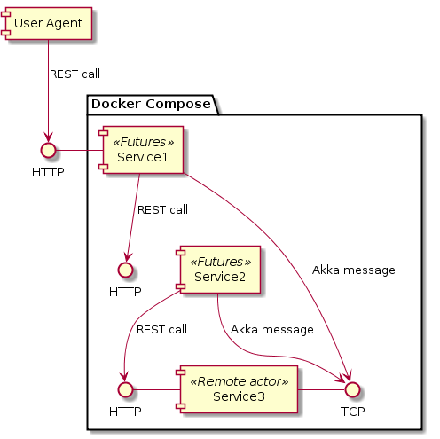

# akka-play-prototype

Simple project with Play and Akka Cluster to bootstrap a POC quickly and test a technical feature on a microservice stack similar to the tdc local stack

## Architecture

### Overview



### Technical features
 - Async computing with scala Futures
 - Akka actors messages (local and remote)
 - Akka cluster (with constructr)
 - Play endpoints
 - Interservice REST calls


### Versions
 - Scala 2.12.6
 - Play 2.6.12
 - Akka 2.5.14

## Build
```
sbt docker:publishLocal
```
## Run
```
docker-compose up -d
```

## Usage
```
./call.sh 10
```
Sends 10 requests on the S1 service each of them propagaging messages to other services
